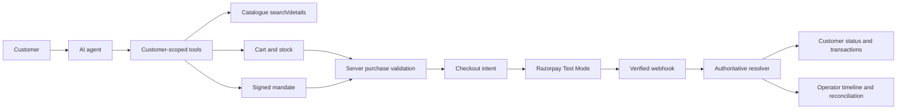

# MandateCart with Authoritative Payment Resolution

An AI shopping assistant that turns a customer's natural-language request into a mandate-scoped cart and a safe Razorpay Test Mode checkout. The agent can search products, surface related recommendations and offers, and prepare the transaction; the server—not the model or browser—decides the payable amount and final payment state.

This Razorpay Buildathon project addresses a practical agentic-commerce problem: AI can understand shopping intent, but authorization, stock, payment truth, and recovery need deterministic controls. It is a small end-to-end demo with a customer storefront and an operator payment console.

## Why this is different

| Capability | Implemented behavior |
| --- | --- |
| Natural-language shopping | The agent interprets requests such as “I want two books” and searches the catalogue. Supported explicit quantities are preserved. |
| Controlled AI actions | The model uses an allowlisted, customer-bound tool set. It cannot access credentials, the database, webhooks, reconciliation, or payment-state mutation directly. |
| Spending authorization | A signed mandate binds customer, merchant, expiry, cap, and preferred categories. Categories guide discovery; server validation checks the actual purchase. |
| Recommendations and offers | Related products carry recommendation attribution and a reason. Seeded offers expose list price, savings, eligibility, validity, and server-derived payable price. |
| Agentic transaction | The agent can move from search to cart validation and checkout creation; product selection remains an explicit customer action. |
| Payment safety | Checkout is idempotent and stateful. Unresolved attempts retain stock and block replacement payment attempts. |
| Customer and operator views | Customers see safe status projections and transaction history. Operators see filtered evidence timelines and can reconcile an existing order. |
| Merchant signal | Metrics include captured revenue, recommendation-item revenue, recommendation acceptance, cross-sell attachment, conversion, and duplicate-charge prevention. |

## How it works



The server reloads catalogue prices and stock, calculates the cart total, revalidates the mandate, and sends that same total to Razorpay. Browser callbacks are observations only. Verified webhook or provider-reconciliation evidence is converted into authority-marked evidence and passed to one resolver.

## Payment safety

| State | Meaning and next action |
| --- | --- |
| `CREATED` | Local intent/attempt exists before the Razorpay order call. An unexpected provider exception moves it to `AMBIGUOUS`. |
| `PENDING` | A Razorpay order exists, but the provider outcome is not final. Dismissal, client reports, delayed webhooks, and `authorized` evidence remain unresolved. |
| `AMBIGUOUS` | The outcome cannot safely be inferred. Stock remains reserved and retry is blocked. |
| `CAPTURED` | Verified provider evidence says the payment was captured. |
| `FAILED` | Verified provider evidence says the payment failed. Reserved stock is released and a new checkout may be created. |
| `REVERSED` / `REFUNDED` | A captured payment later reached the corresponding verified provider state. |

The implementation guarantees:

- Razorpay dismissal is audited as `CLIENT_CHECKOUT_DISMISSED`; it leaves the attempt `PENDING`, retains stock, and does not open an unsafe replacement checkout.
- Browser payment IDs are provisional audit data. The canonical payment ID comes from verified Razorpay evidence.
- `payment.authorized` is not treated as `CAPTURED`.
- Only verified webhook or Razorpay reconciliation evidence can normally resolve an attempt.
- Contradictory or invalid evidence preserves the existing state and creates an audit exception; terminal states are not downgraded.
- Duplicate `X-Razorpay-Event-Id` values are handled idempotently.
- An uncertain provider call becomes `AMBIGUOUS`, not `FAILED`, so stock and the no-retry boundary are preserved.
- Stock is released only on authoritative `FAILED` resolution.
- Reconciliation reads the existing Razorpay order's payments and never creates a replacement order.
- The same `(customer_id, client_request_id)` returns the existing checkout result instead of creating another provider order.

The database keeps append-only, ordered audit events for checkout creation, browser observations, webhook receipt, resolution, contradictions, and reconciliation checks.

## Customer experience

The customer view at `/` provides:

- A signed spending-mandate editor with a “Things I want” category picker.
- Natural-language chat with structured product results.
- Explicit product selection and quantities.
- Server-backed cart totals and mandate validation.
- Recommendation cards with source attribution, offer details, and reasons when available.
- Razorpay launch only when the persisted payment projection permits it.
- Customer-safe transaction history and polling while payment is unresolved.

The demo intentionally binds the customer surface to `customer_demo`; it is not a production authentication or multi-tenant implementation.

## Operator experience

The operator view at `/operator` is protected by `OPERATOR_VIEW_TOKEN`. It supports searching persisted attempts, viewing amount/mandate/order/payment state, inspecting filtered evidence, and reconciling the existing Razorpay order without creating another charge. Its metrics include recommendation revenue calculated from captured cart items whose attribution is `recommendation`, not from total cart value.

## Demo walkthrough

### 1. Start the project

```sh
cp .env.example .env
# Fill .env with local PostgreSQL values, an AI provider,
# mandate secrets, and Razorpay Test Mode credentials.
make dev
```

Open [http://127.0.0.1:8000/](http://127.0.0.1:8000/). The seed loads books, clothing, accessories, related products, simple offers, an out-of-stock recommendation fixture, and a restricted product.

### 2. Use the mandate

The seed provides `customer_demo` with `mandate_demo_valid`: a signed, non-expired mandate with a ₹500 cap and `books` as the initial preferred category. Use the form to adjust the cap or “Things I want” for another demo. Preferences guide search and recommendations; final validation enforces customer/merchant ownership, expiry, signature, stock, restrictions, and spending limit.

### 3. Shop and select

Try:

```text
I want 1 book
```

The agent reads the mandate, searches the allowed catalogue, and returns structured product cards. A related product, when shown, is labelled as a recommendation. Select products explicitly and review the cart.

### 4. Create checkout

The cart reloads price and stock on the server. Choose **Create checkout** after validation passes. The server creates one intent, reserves stock, and sends the server total to Razorpay Test Mode.

### 5. Complete Test Mode payment

Choose a Test Mode payment method in the Razorpay Checkout modal. A browser callback may report a reference, but the customer remains confirmation-pending until verified provider evidence arrives.

For a real webhook, configure the Razorpay Test Mode webhook URL to reach:

```text
POST https://<reachable-host>/webhooks/razorpay
```

The endpoint requires `RAZORPAY_WEBHOOK_SECRET` and Razorpay's `X-Razorpay-Signature` and `X-Razorpay-Event-Id` headers. A local tunnel such as ngrok is only needed when Razorpay cannot reach the local server directly.

### 6. Inspect resolution

- Customer: view status, order/payment references, payable total, and the processing timeline.
- Operator: open `/operator`, enter `OPERATOR_VIEW_TOKEN`, search the intent/order ID, and inspect authoritative evidence.

To demonstrate an unresolved path, dismiss Checkout or use the labelled demo timeout action. The attempt remains unresolved and blocks another payment. To exercise the signed HTTP webhook boundary locally:

```sh
uv run python -m backend.demo --order-id ORDER_ID --payment-id pay_demo --status captured
```

`backend.demo` is a local replay harness, not a replacement for a real Razorpay Test Mode transaction.

## Tech stack

- Python 3.11+ standard-library HTTP server and `urllib` provider adapters.
- PostgreSQL 16 with `psycopg` 3.
- Docker Compose for local PostgreSQL.
- `uv` for Python environment and commands.
- Vanilla HTML, CSS, and JavaScript for customer and operator views.
- Razorpay Checkout.js and REST API for Test Mode orders and payment reads.
- Google Gemini `generateContent` as the preferred agent model, with optional OpenRouter chat-completions fallback. Both use the provider-neutral tool-calling loop.

## Project structure

| Path | Responsibility |
| --- | --- |
| `agent/` | Tool definitions, customer binding, model loop, Gemini, and OpenRouter adapters. |
| `backend/catalogue.py` | Catalogue, offers/recommendations, carts, mandates, and purchase validation. |
| `backend/checkout.py` | Checkout intents, stock reservation, Razorpay order boundary, and audit writes. |
| `backend/razorpay.py` | Test Mode order creation and existing-order payment lookup. |
| `backend/webhooks.py` | Raw-body signature verification, deduplication, correlation, and evidence handoff. |
| `backend/resolver.py` | Authoritative payment transitions and reconciliation. |
| `backend/views.py` | Customer/operator projections and merchant metrics. |
| `backend/main.py` | Same-origin HTTP routes. |
| `backend/schema.sql` | PostgreSQL tables, constraints, indexes, and append-only audit trigger. |
| `frontend/` | Customer storefront/payment UI and operator console. |
| `tests/` | Database-backed catalogue, agent, payment, webhook, HTTP, projection, and demo-flow tests. |
| `Makefile` | Database, migration, seed, development, and test commands. |

## Setup and configuration

### Prerequisites

- Python 3.11 or newer
- Docker Desktop with Docker Compose
- [`uv`](https://docs.astral.sh/uv/)
- Razorpay Test Mode credentials for real checkout
- A Gemini or OpenRouter API key for live agent chat

### Environment variables

Copy `.env.example` to `.env`, replace its placeholders, and never commit `.env`.

| Variable | Purpose |
| --- | --- |
| `RAZORPAY_KEY_ID` | Test Mode key ID; must begin with `rzp_test_`. |
| `RAZORPAY_KEY_SECRET` | Server-side Test Mode API secret. |
| `RAZORPAY_WEBHOOK_SECRET` | HMAC secret for the exact webhook request body. |
| `MANDATE_SIGNING_SECRET` | HMAC secret for mandate fields. |
| `MERCHANT_ID` | Merchant identity bound into mandates. |
| `OPERATOR_VIEW_TOKEN` | Token required by operator routes. |
| `GEMINI_API_KEY`, `GEMINI_MODEL` | Preferred Gemini adapter and model. |
| `OPENROUTER_API_KEY`, `OPENROUTER_MODEL` | Optional fallback adapter and tool-calling model. |
| `POSTGRES_DB`, `POSTGRES_USER`, `POSTGRES_PASSWORD` | Docker PostgreSQL settings. |
| `POSTGRES_HOST_PORT` | Host port mapped to PostgreSQL, default `5432`. |
| `DATABASE_URL` | Application PostgreSQL connection string. |
| `DEMO_MODE` | Must be `1` for the delayed replay header used by `backend.demo`. |
| `WEBHOOK_RETENTION_DAYS` | Webhook payload cleanup period. |

### Commands

The Makefile loads `.env` automatically:

```sh
make db-up       # Start PostgreSQL and wait for health
make migrate     # Apply the idempotent schema
make seed        # Load demo products and mandates
make dev         # Start the app at http://127.0.0.1:8000
make test        # Run the full unittest suite
make db-down     # Stop the Compose service
```

For direct module commands:

```sh
set -a
source .env
set +a
uv run python -m backend.migrate
uv run python -m backend.seed
uv run python -m backend.main
```

The application uses a named Docker volume for PostgreSQL data. Application commands do not reset or recreate it.

## Testing

Run:

```sh
make test
```

The current verified result is **125 tests passed, 0 failed**. The suite uses local PostgreSQL and mocks outbound Razorpay provider calls. It covers offers and authoritative totals, cart attribution, mandate validation, agent boundaries, checkout idempotency, stock handling, browser evidence, webhook verification/deduplication, authoritative resolution, reconciliation, customer/operator projections, and the pitch flow.

Additional repository checks:

```sh
python3 -m compileall -q backend agent tests
for f in frontend/*.js; do node --check "$f"; done
git diff --check
```

## Design and security considerations

The language model orchestrates tools; it is not a payment authority. `agent.tools.tools_for(customer_id)` binds customer context outside model arguments and exposes only the allowlist. The loop validates tool shapes, limits the post-checkout tool set, and removes payment creation after an unresolved or rejected checkout.

Mandates are signed and checked at the server boundary. Cart creation reloads catalogue prices and stock; checkout revalidates customer, merchant, expiry, restrictions, stock, and spending cap in a transaction. Recommendation metadata can broaden discovery, but explicit selection still goes through final validation.

Razorpay order creation is separate from payment resolution. The server persists an attempt before calling the provider, uses advisory locks and request IDs for idempotency, verifies webhook signatures over raw bytes, deduplicates provider events, and routes verified evidence through one resolver. The browser cannot mark a payment captured, and the model never receives raw provider payloads or credentials.

This is a local buildathon demo, not a production payment deployment. Customer authentication, multi-tenant isolation, production secret management, and operational webhook hosting are outside the implemented scope.

## Razorpay Buildathon fit

The implemented Track 1 story is:

- AI-readable, database-backed catalogue
- Natural-language shopping intent
- Offers and related-product recommendations
- Explicit customer product selection
- Agent-controlled cart and checkout preparation
- Razorpay Test Mode checkout
- Verified payment resolution and duplicate-charge protection
- Customer transaction and operator evidence experiences
- Merchant metrics based on persisted cart, recommendation, and payment data

The central product decision is deliberate: AI helps decide what to look for, while deterministic server code decides what may be bought, how much is payable, and whether payment is final.
